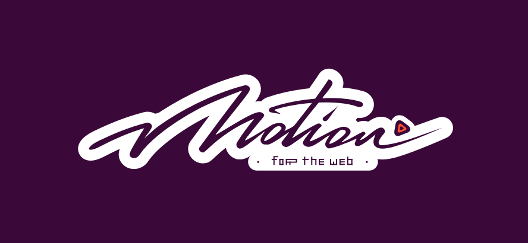

# mo · js –    

The motion graphics toolbelt for the web.

## Intro
**mo · js** is a javascript motion graphics library that is a **fast, retina ready, modular and open source**. In comparison to other libraries, it have a different syntax and code animation structure approach. The declarative API provides you a complete control over the animation, making it customizable with ease.

The library provides **built-in components** to start animating from scratch like html, shape, swirl, burst and stagger, but also bring you tools to help craft your animation in a most natural way. Using mojs on your site will enhance the user experience, enrich your content visually and create **delightful animations** precisely.

## Demos
- [Motion Graphics for the Web](https://codepen.io/sol0mka/full/ogOYJj/)
- [Bubble Layout](https://codepen.io/sol0mka/full/yNOage/)
- [Sleepy Mole](https://codepen.io/sol0mka/full/OyzBXR)
- [Animocons](https://tympanus.net/Development/Animocons/)
- [Love or Hate Modal](https://codepen.io/sol0mka/full/812699ce32c9a7aeb70c9384b32a533a/)
- [Mograph](https://codepen.io/sol0mka/full/39427561a8a0b15d7896480a7d96d3d1/)
- [Word Reveal](https://codepen.io/sol0mka/full/c94452fb65dbf676b0ae8a12d4267473/)
- [Jump and Squash](https://codepen.io/sol0mka/full/pEagoL/)
- [Physical Balls](https://codepen.io/sol0mka/full/7315f4364360ec87a6655d33782702fe/)
- [Dust Trail](https://codepen.io/sol0mka/full/633e6aa52d40691cca2f2cda91650bae/)
- [Bubble Modal](https://codepen.io/sol0mka/full/3c49de2d7d0ca3e92bf5db5bf7a2687d/)
- [Bubbles](https://codepen.io/sol0mka/full/2ef10ed42ff535182c31cd1dbb81e453/)
- [Blast](https://codepen.io/sol0mka/full/699cfc8716a13e0e1c15105af2b6fb95/) (click to see)
- [Simple Burst](https://codepen.io/sol0mka/full/6caf96461207a5caa9226fbd2631569d/) (click to see)
- [Dusty Burst](https://codepen.io/sol0mka/full/03e9d8f2fbf886aa1505c61c81d782a0/) (click to see)
- [Twitter Fav](https://codepen.io/sol0mka/full/wWdRLk/) (click to see)
- [Twitter Fav (stars)](https://codepen.io/sol0mka/full/PzmAym/) (click to see)
- [Twitter Fav Firework](https://codepen.io/sol0mka/full/xOAKKA/) (click to see)
- [Simple Ripple](https://codepen.io/sol0mka/full/XKdWJg/) (click to see)

## Tutorials
- Shape & Swirl (broken link) [API/shape](/api/shape.md)
- Burst (broken link) [API/burst](/api/burst.md)
- Path Easing (broken link) [API/easing/path-easing](/api/easing/path-easing.md)
- [Video with MojsPlayer and MojsCurveEditor](https://vimeo.com/185587462)
- [Icon Animations Powered by mo.js](https://tympanus.net/codrops/2016/02/23/icon-animations-powered-by-mo-js/)
- [An Introduction to mo.js, by Sarah Drasner](https://css-tricks.com/introduction-mo-js/)
- [Web Animations and Mo.js with Sarah Drasner](https://www.youtube.com/watch?v=yRxWa8lXasI) *[Video]*

## Documentation
- [Reference](/api)

## Tools
- [Player](https://github.com/mojs-contrib/mojs-player)
- [Curve editor](https://github.com/mojs-contrib/mojs-curve-editor)
- [Timeline editor](https://github.com/mojs-contrib/mojs-timeline-editor)

## Installation
npm: `npm install @mojs/core`  
cdn: ``  
bower: `bower install mojs`

## Target browsers
- Chrome 4+
- Firefox 4+
- Opera 11.5+
- Safari 4+
- IE 9+

## Kudos
Meet some of the outstanding guys that support `mojs` on [Patreon](https://patreon.com/user?u=3219311&utm_medium=social&utm_source=twitter&utm_campaign=creatorshare):

- [Zak Frisch](https://github.com/zfrisch)
- [Erhan Karadeniz](https://twitter.com/erhankaradeniz)
- [Jorge Antunes](https://github.com/stoikerty)
- [Daniel C. Henning](https://github.com/danielsdesk)
- [Chris Dolphin](https://github.com/likethemammal)
- [Volodymyr Kushnir](https://twitter.com/VovaKushnir)
- [Wojtek Jodel]()
- [Roman Kuba](https://github.com/codebryo)
