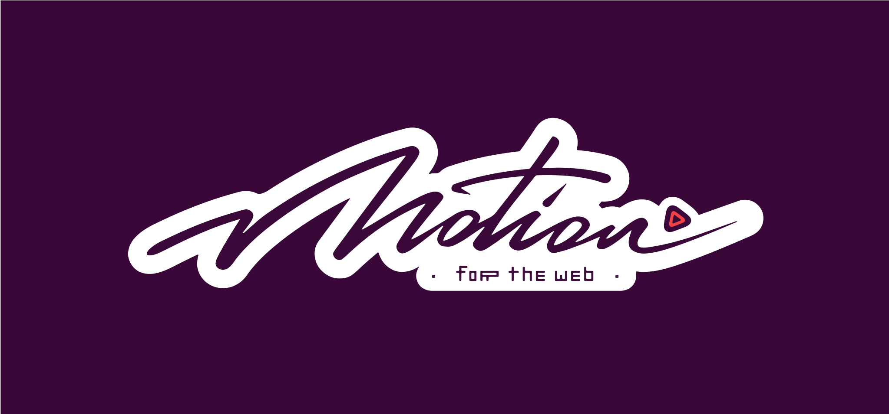

# mo · js – [](https://www.npmjs.com/package/@mojs/core) [](https://github.com/mojs/mojs/actions?query=workflow:"CI") [](https://coveralls.io/r/mojs/mojs?branch=master) [](https://join.slack.com/t/mojs/shared_invite/zt-dlyxhupt-VR7eV2uwCnvu3Cx~Yc_L9Q)

The motion graphics toolbelt for the web.

[](https://mojs.github.io/)

## Intro
**mo · js** is a javascript motion graphics library that is a **fast, retina ready, modular and open source**. In comparison to other libraries, it has a different syntax and code animation structure approach. The declarative API provides you a complete control over the animation, making it customizable with ease.

The library provides **built-in components** to start animating from scratch like html, shape, swirl, burst and stagger, but also bring you tools to help craft your animation in a most natural way. Using mojs on your site will enhance the user experience, enrich your content visually and create **delightful animations** precisely.

## Install
### Use with a bundler

Mojs is published on the **NPM registry** and **GPR registry**, so you can install it through the command line interpreter using your favorite package manager. This is the best way to install the library if you are comfortable with **javascript bundlers** like `webpack` or `rollup`.

```sh
# npm
npm install @mojs/core

# yarn
yarn add @mojs/core
```

Then **import it like any other module** inside your build:

```js
import mojs from '@mojs/core';

new mojs.Html({
  // ...
});
```

> Using a bundler has **many advantages** like output compression, code splitting, tree shaking, etc., so we encourage you to use this kind of tool with mojs.

### Use with a CDN

To rapidly **include the minified production file** in your webpage, load the latest build from your favorite CDN using a generic script markup:

```html
<!-- unpkg -->
<script src="https://unpkg.com/@mojs/core"></script>

<!-- jsdelivr -->
<script src="https://cdn.jsdelivr.net/npm/@mojs/core"></script>
```

Then instanciate using:

```html
<script>
  new mojs.Html({
    // ...
  });
</script>
```

> By default, if no one is specified, the CDN will automatically target the **@latest** version of mojs and load the **UMD build** from `dist/mo.umd.js`.

## User guide
The base documentation you need to get started with mojs.
- [Get started](https://mojs.github.io/tutorials/getting-started.html)
- [@mojs/player](https://github.com/mojs/mojs-player/)
- [@mojs/curve-editor](https://github.com/mojs/mojs-curve-editor/)
- [@mojs/timeline-editor](https://github.com/mojs/mojs-timeline-editor/)

## Learn
Discover the amazing things that mojs can do!
- [Shape & Swirl](https://mojs.github.io/tutorials/shape-swirl/) _(Tutorial)_
- [Burst](https://mojs.github.io/tutorials/burst/) _(Tutorial)_
- [Icon animations powered by mo.js](https://tympanus.net/codrops/2016/02/23/icon-animations-powered-by-mo-js/) _(Codrops tutorial)_
- [An Introduction to mo.js](https://css-tricks.com/introduction-mo-js/) _(CSS tricks tutorial)_
- [Playing with @mojs/player and @mojs/curve-editor](https://vimeo.com/185587462) _(Vimeo video)_
- [Web animations and mo.js](https://www.youtube.com/watch?v=yRxWa8lXasI) _(Youtube video)_

## Developer
Get technical informations, open an issue/pull request or join the (amazing) community!
- [API documentation](https://mojs.github.io/api/)
- [Github](https://github.com/mojs/mojs/)
- [Slack workspace](https://mojs.slack.com) _(Not in the workspace yet? Use the [invite link](https://join.slack.com/t/mojs/shared_invite/zt-dlyxhupt-VR7eV2uwCnvu3Cx~Yc_L9Q) 🔓)_

## Showcase
- [Motion Graphics for the Web](https://codepen.io/sol0mka/full/ogOYJj/)
- [Bubble Layout](https://codepen.io/sol0mka/full/yNOage/)
- [Sleepy Mole](https://codepen.io/sol0mka/full/OyzBXR/)
- [Animocons](https://tympanus.net/Development/Animocons/)
- [Love or Hate Modal](https://codepen.io/sol0mka/full/812699ce32c9a7aeb70c9384b32a533a/)
- [Mograph](https://codepen.io/sol0mka/full/39427561a8a0b15d7896480a7d96d3d1/)
- [Word Reveal](https://codepen.io/sol0mka/full/c94452fb65dbf676b0ae8a12d4267473/)
- [Jump and Squash](https://codepen.io/sol0mka/full/pEagoL/)
- [Physical Balls](https://codepen.io/sol0mka/full/7315f4364360ec87a6655d33782702fe/)
- [Dust Trail](https://codepen.io/sol0mka/full/633e6aa52d40691cca2f2cda91650bae/)
- [Bubble Modal](https://codepen.io/sol0mka/full/3c49de2d7d0ca3e92bf5db5bf7a2687d/)
- [Bubbles](https://codepen.io/sol0mka/full/2ef10ed42ff535182c31cd1dbb81e453/)
- [Blast](https://codepen.io/sol0mka/full/699cfc8716a13e0e1c15105af2b6fb95/) _(click to see)_
- [Simple Burst](https://codepen.io/sol0mka/full/6caf96461207a5caa9226fbd2631569d/) _(click to see)_
- [Dusty Burst](https://codepen.io/sol0mka/full/03e9d8f2fbf886aa1505c61c81d782a0/) _(click to see)_
- [Twitter Fav](https://codepen.io/sol0mka/full/wWdRLk/) _(click to see)_
- [Twitter Fav (stars)](https://codepen.io/sol0mka/full/PzmAym/) _(click to see)_
- [Twitter Fav Firework](https://codepen.io/sol0mka/full/xOAKKA/) _(click to see)_
- [Simple Ripple](https://codepen.io/sol0mka/full/XKdWJg/) _(click to see)_

## Browser support
- Chrome 49+
- Firefox 70+
- Opera 36+
- Safari 8+
- Edge 79+

> Many other browsers may work, but are not extensively tested.

## Maintainers
Since 2019, mojs ecosystem is **maintained and developed** by:
- [Xavier Foucrier](https://github.com/xavierfoucrier)
- [Jonas Sandstedt](https://github.com/Sandstedt)

## Kudos
Meet some of the outstanding guys that support mojs on [Patreon](https://patreon.com/user?u=3219311&utm_medium=social&utm_source=twitter&utm_campaign=creatorshare):

- [Zak Frisch](https://github.com/zfrisch)
- [Erhan Karadeniz](https://twitter.com/erhankaradeniz)
- [Jorge Antunes](https://github.com/stoikerty)
- [Daniel C. Henning](https://github.com/danielsdesk)
- [Chris Dolphin](https://github.com/likethemammal)
- [Volodymyr Kushnir](https://twitter.com/VovaKushnir)
- [Wojtek Jodel]()
- [Roman Kuba](https://github.com/codebryo)
